# Sovereign Gemini GGUF

[](#license)
[](#verification)
[](#quick-start)
[](#security)
[](#tests)

> **No torch. No TF. No network. Just `mmap` and `struct`.**

Standalone, zero-dependency GGUF binary parser and neural Graph IR for Gemini-class sovereign models. Parses 15.48GB, 291 tensors, 36 blocks — without loading weights.

Cherry-picked from `sovereign-cuda-kernels` mass repo. Public, tri-licensed.

---

## What This Parses

A GGUF file is three contiguous blocks: **Header (24B)** → **Metadata KV table** → **Tensor descriptors + aligned binary data**. This parser reconstructs the full transformer topology from that binary alone.

| Block | What it contains | How we parse it |
|-------|------------------|-----------------|
| Header | `GGUF` magic, version 2/3, 291 tensor count, KV count | `struct.unpack_from("<IQQ", mm, 4)` |
| Metadata | `general.architecture=gemini`, `gemini.*` hyper-params, alignment | `GGUFValueType` 0–12, string/array limits |
| Tensors | 291 descriptors: `name`, `n_dims`, `shape`, `GGML dtype`, `relative_offset` → `file_offset` | `block_size/bytes_per_block` per quant, overlap + bounds checks |

---

## Flow

```mermaid
flowchart LR
    A[model.gguf<br/>15.48GB on disk] --> B[GGUFMmapReader<br/>mmap.ACCESS_READ<br/>memoryview, zero-copy]
    B --> C[GGUFParser<br/>_parse_header<br/>_parse_metadata<br/>_calculate_tensor_offsets]
    C --> D{Security Gates}
    D -->|MAX_STRING 1M<br/>MAX_TENSOR 500k<br/>MAX_ARRAY 10M| E[ModelConfig<br/>gemini.embedding_length<br/>gemini.block_count<br/>GQA 32/8]
    E --> F[ModelGraph<br/>36× TransformerBlockNode<br/>GQA + SwiGLU + RMSNorm]
    F --> G[Graph IR<br/>TOPOLOGY: TOKEN_IDS → EMBEDDING → 36× BLOCK → FINAL_NORM → LOGITS]
    G --> H[validate / evoke<br/>291 tensors bound<br/>memoryview slices]

    style B fill:#0ea5e9,stroke:#0284c7,color:#fff
    style C fill:#22c55e,stroke:#16a34a,color:#fff
    style F fill:#f59e0b,stroke:#d97706,color:#fff
    style H fill:#a855f7,stroke:#9333ea,color:#fff
```



```mermaid
flowchart TD
    subgraph Block["Transformer Block N (0..35)"]
        A[attn_norm.weight<br/>RMSNorm 4096] --> B[GQA<br/>Q 4096→4096 | K/V 4096→1024<br/>RoPE + QK-Norm + repeat_interleave 4×]
        B --> C[attn_output.weight<br/>4096→4096 + residual]
        C --> D[ffn_norm.weight<br/>RMSNorm 4096]
        D --> E[SwiGLU<br/>gate 4096→14336<br/>up 4096→14336<br/>SiLU(gate) ⊙ up → down 14336→4096]
        E --> F[Residual]
    end
    F --> G[Next Block]
```

---

## Architecture It Reconstructs

**Gemini-class sovereign:** 36 layers, 4096 hidden, GQA 32 Q / 8 KV (factor 4, head_dim 128), SwiGLU 14336, vocab 256000, context 512, RoPE `θ=10000`, RMSNorm `ε=1e-5`, 291 tensors (Q4_K/Q6_K + F32 norms).

| Tensor class | Example | Dtype | Per-layer bytes |
|--------------|---------|-------|-----------------|
| `attn_q` | `blk.0.attn_q.weight` | Q4_K 256→144 | 9,437,184 |
| `attn_k` | `blk.0.attn_k.weight` | Q4_K | 2,359,296 |
| `attn_v` | `blk.0.attn_v.weight` | Q6_K 256→210 | 3,440,640 |
| `attn_output` | `blk.0.attn_output.weight` | Q4_K | 9,437,184 |
| `ffn_gate/up` | `blk.0.ffn_gate.weight` | Q4_K | 33,030,144 each |
| `ffn_down` | `blk.0.ffn_down.weight` | Q6_K | 48,168,960 |
| `attn_norm/ffn_norm` | `blk.0.attn_norm.weight` | F32 | 16,384 each |

Weight tying detected: `T000 token_embd.weight ↔ T290 output.weight` (same `file_offset` + `byte_size`).

See `src/architecture/graph.py:1` for `ModelGraph` → `TransformerBlockNode` IR.

---

## Param Count

`src/validation/parameters.py:1` counts from tensor descriptors alone — no weights loaded:

```python
from src.validation.parameters import ParameterCounter
params = ParameterCounter.count(parser.tensors)
# {
#   "total_parameters": 15482390528,  # 15.48B incl. quant overhead
#   "total_parameters_billions": 15.483,
#   "breakdown": {"embedding": 1048576000, "attention": X, "mlp": Y, ...}
# }
```

Actual model params (dequantized): ~6.15B (Meridian-G6) / 0.3M (Nano). GGUF byte size includes Q4_K block overhead.

---

## Quick Start

```bash
git clone https://github.com/SNAPKITTYWEST/sovereign-gemini-gguf
cd sovereign-gemini-gguf
pip install -e .  # or: no install, stdlib only

# Inspect any GGUF without loading it
python sovereign_gemini_gguf.py inspect model.gguf
python sovereign_gemini_gguf.py architecture model.gguf --json | jq
python sovereign_gemini_gguf.py graph model.gguf --json | jq .blocks[0]
python sovereign_gemini_gguf.py validate model.gguf  # zero-sorry
python sovereign_gemini_gguf.py evoke model.gguf      # bind 291 tensors, zero-copy
python -m src.tests.test_parser  # 3/3 PASS
python sovereign_gemini_gguf.py test  # same
```

```python
from src.gguf.reader import GGUFParser
from src.architecture.config import ModelConfig
from src.architecture.graph import ModelGraph

p = GGUFParser("model.gguf")
p.parse()  # header + metadata + tensor offsets + overlap + bounds

config = ModelConfig(p.metadata, p.tensors)  # gemini.embedding_length, block_count, etc.
graph = ModelGraph(config, p.tensors)        # 36 blocks, weight tying

# Zero-copy slice (no copy, just memoryview)
slice_mv = p.read_tensor_slice("token_embd.weight", offset_elements=0, count_elements=4096)

print(graph.to_dict()["weight_tying"])  # True if T000 == T290
print(graph.export_ir()["topology"])    # ["TOKEN IDS", "TOKEN EMBEDDING", "TRANSFORMER BLOCK 0", ...]
```

---

## Security

Zero-trust: every GGUF is untrusted binary.

| Guard | Value | Where |
|-------|-------|-------|
| `MAX_STRING_LENGTH` | 1,048,576 (1M) | `src/gguf/mmap.py:1` |
| `MAX_TENSOR_COUNT` | 500,000 | `src/gguf/reader.py:1` |
| `MAX_METADATA_COUNT` | 1,000,000 | `src/gguf/reader.py:1` |
| `MAX_ARRAY_ELEMENTS` | 10,000,000 | `src/gguf/metadata.py:1` |
| `MAX_DIMENSION_COUNT` | 8 | `src/gguf/tensor.py:1` |
| Overlap check | sorted by `file_offset`, `curr.offset+size ≤ next.offset` | `src/validation/offsets.py:1` |
| Bounds check | `abs_offset+byte_size ≤ file_size` | `src/validation/offsets.py:1` |
| No code exec | `decode("utf-8")` only, no `eval`/`exec`/`unpickle` | `src/gguf/mmap.py:1` |

All reads are `memoryview` slices — no buffer copy.

---

## Tests

```bash
python -m src.tests.test_parser      # mock_gemini.gguf v3, 2 tensors, slicing
python -m src.tests.test_validation  # hidden_dim divisibility, shape
python -m src.tests.test_security    # overlap detect, bounds
```

Mock fixture: GGUF v3, `general.architecture=gemini`, `embedding_length=64`, `block_count=1`, `token_embd.weight` 64×128 F32 at offset 0, `blk.0.attn_q.weight` 64×64 F32 at 32768, 32-byte aligned.

---

## Structure

```
sovereign_gemini_gguf.py          # single-file facade (imports src/)
src/gguf/{mmap,header,metadata,tensor,reader}.py
src/architecture/{detector,config,attention,mlp,graph}.py
src/validation/{shapes,offsets,parameters}.py
src/meridian/{config,normalization,patches,parameters,inference,validation,data,embeddings,model}.py
src/cli/main.py                   # inspect|metadata|tensors|architecture|graph|validate|evoke|test
src/tests/{test_parser,test_validation,test_security}.py
docs/{GGUF_FORMAT,ARCHITECTURE,GRAPH_IR,SECURITY,TEST_REPORT}.md
```

---

## License

Tri-licensed: **Sovereign Source License v1.0** (Bel Esprit d'Accord Trust · 2026-06-01) | **BSL-1.1** (Change Date 2030-06-01 → Apache 2.0) | **AGPL-3.0**. See `LICENSE`.

Headers `SNAPKITTYWEST-PROPRIETARY-2026-001` preserved. Prior art: SHA3-512 + WORM.

Contact: **Ahmad Ali Parr** <ahmedparr93@gmail.com> · Bel Esprit D'Accord Trust

---

*The GGUF is untrusted. The parser is zero-sorry. The graph is the model.*
